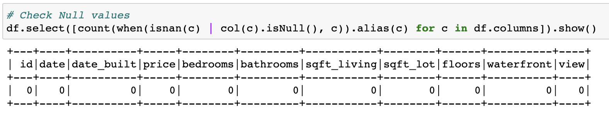
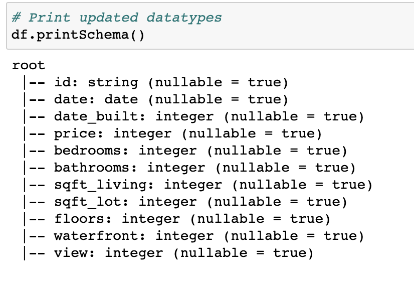
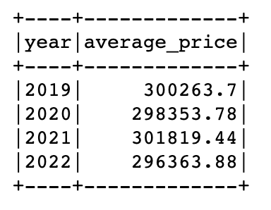
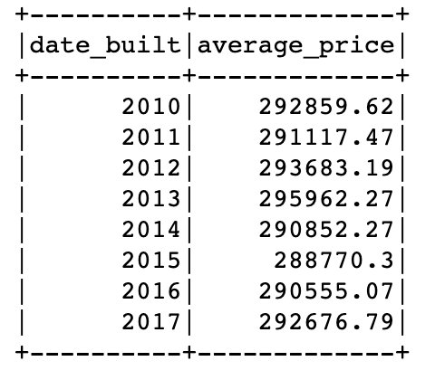
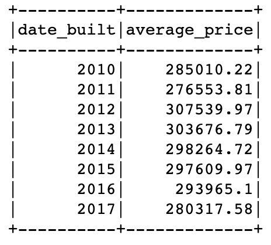
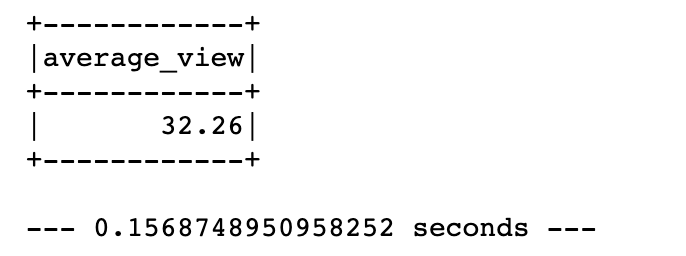
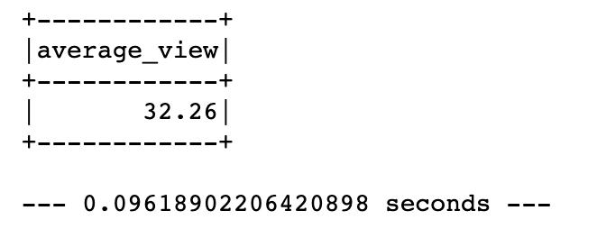
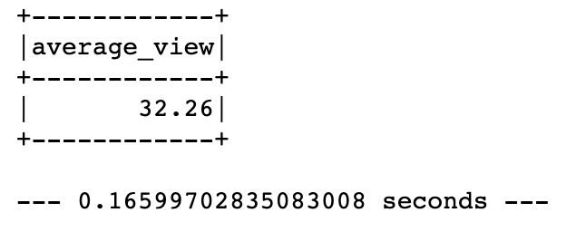

# Home_Sales

Table of Contents
=================

  * [Objective](#objective)
  * [Home Sales Notebook](#home-sales-notebook)
  * [Method](#method)
  * [Summary](#summary)
  * [References](#references)
  
  
  
## Objective
Using knowledge of SparkSQL to determine key metrics about home sales data. Then use Spark to create temporary views, partition data, cache and uncache a temporary table and finally verify that the table has been uncached. 

## Home Sales Notebook

Please see the file [Home_Sales](Notebook/Home_Sales.ipynb) for full details regarding the home sales data.  

## Method

### Initialization

* Import necessary PySpark SQL functions
* Read the `home_sales_revised.csv` daata into a Spark DataFrame
* Check for null values, update data types and add `year` column

  
  

* Create temporary table called `home_sales`

### Queries

Answered the following questions using SparkSQL:

1. What is the average price for a four-bedroom house sold for each year? Round to two decimal places.
  

2. What is the average price of a home for each year it was built that has three bedrooms and three bathrooms? Round to two decimal places.
  

3. What is the average price of a home for each year that has three bedrooms, three bathrooms, two floors, and is greater than or equal to 2,000 square feet? Round to two decimal places.
  

4. What is the "view" rating for homes costing more than or equal to $350,000? Determine the run time for this query, and round to two decimal places.
  

### Cache, Partitioning and Uncache

* Cache temporary table `home_sales` and check if tabled is cached.
* Using cached data, run query filtering view ratings with average price of greater than or equal to $350,000. Determine run time and compare it to uncached runtime. 

  

* Partition by `date_built` field on formatted parquet home sales data.
* Create temporary table for parquet data.
* Run query filtering out the view ratings with an average price of greater than or equal to $350,000. Determine the runtime and compare it to uncached runtime.

  

* Uncache `home_sales` temporary table. 
* Verify `home_sales` temporary table is uncached using PySpark. 

## Summary

Three methods were utilized to compare the efficiency in processing the dataset, which included uncached, cached and parquet partitioned. As we can see, the cached method obtained the fastest and most efficient processing time of 0.0962 seconds, in comparison to the uncached and parquet partitioned method at a time of 0.1569 seconds and 0.1660 seconds, respectively. It would be anticipated that the parquet partitioned would have been the fastest method, as it utilized both caching and partitioning, however, this may be more evident in a much larger dataset. Regardless, this outcome identifies that utilizing caching techniques can improve runtime of data analysis tasks, which may be beneficial when working with larger datasets.  

## References 

* Dataset provided by edX UofT Data Analytics, which had been generated by Trilogy Education Services, LLC. This is intended for educational purposes only.

- - -

